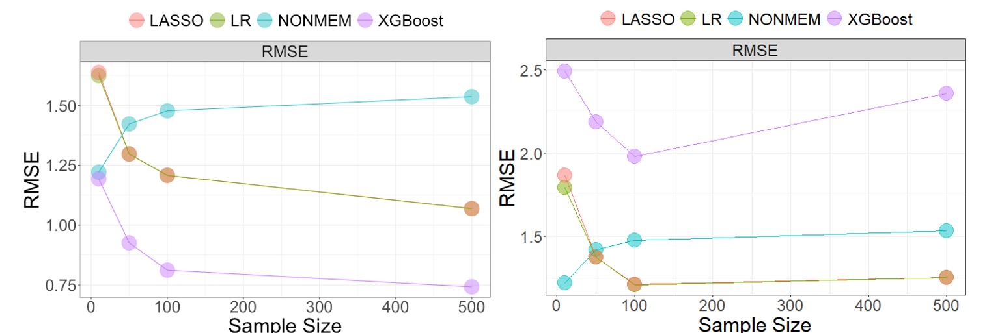

# AI/ML vs NONMEM for Population Pharmacokinetic Prediction

This code repository provides the code to reproduce the AI/ML results in the paper

>**Opportunities for AI-based Model-Informed Drug Development: A Comparative Analysis of NONMEM and AI-Based Models for Population Pharmacokinetic Prediction** Bingyu Mao, Yue Gao, Christine Xu, Sreeraj Macha, Shuai Shao, Malidi Ahamadi

## Overview

This project explores the use of artificial intelligence (AI) and machine learning (ML) methods for population pharmacokinetic (PPK) modeling within the context of model-informed drug development (MIDD). It provides a comparative analysis between traditional nonlinear mixed-effects (NLME) modeling approaches, such as NONMEM, and a range of AI-based models, including machine learning (ML), deep learning (DL), and neural ordinary differential equations (ODEs). The evaluation is conducted using both simulated datasets and real-world clinical data, with a focus on predictive performance across various modeling scenarios.

## Steps to reproduce the AI/ML results

### Data

### Requirements

- Python 3.10;
- Required Python packages can be installed using `pip install -r requirements.txt`.

### Model training and evaluation

Please follow the steps in the notebooks to run the ML, DL, and neural ODE models.

## Results

The performance of AI-based models was evaluated against traditional NLME methods using both simulated and real clinical datasets. Metrics such as root mean squared error (RMSE), mean absolute error (MAE), and coefficient of determination (R²) were used to assess predictive accuracy across different modeling scenarios. The results highlight the strengths and limitations of each modeling approach, offering insights into how AI/ML techniques can complement or enhance traditional methods in population pharmacokinetic modeling.

The figure illustrates the impact of sample size on model performance across two simulated datasets. It compares RMSE, MAE, and R² metrics for various machine learning models and NONMEM at different sample sizes (500, 100, 50, and 10 patients). In general, ML models outperformed NONMEM at larger sample sizes, while NONMEM showed stronger performance and higher explainability (as indicated by R²) in smaller datasets. The results highlight how model performance varies with data availability and model type.

  

## Contact

Please post a GitHub issue if you have any questions.

## Citation

Please acknowledge the following work in papers or derivative software:

Bingyu Mao, Yue Gao, Christine Xu, Sreeraj Macha, Shuai Shao, Malidi Ahamadi. "Opportunities for AI-based Model-Informed Drug Development: A Comparative Analysis of NONMEM and AI-Based Models for Population Pharmacokinetic Prediction"
